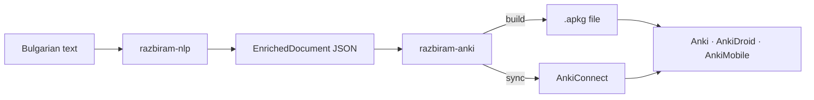

# razbiram-anki

**Turn enriched Bulgarian texts into beautiful, well-structured Anki decks — morphology, contextual glosses, and CEFR levels included.**

`razbiram-anki` is a small bridge between [razbiram-nlp](https://github.com/leonkoellerwirth-arch/razbiram-nlp) and [Anki](https://apps.ankiweb.net/). It reads the enriched-document JSON that razbiram-nlp produces and writes a standard `.apkg` deck: one clean, dark-mode-aware card per vocabulary word, with lemma, part of speech, compact morphology, a contextual gloss, an example sentence pulled straight from your text with the target word highlighted, and a colour-coded CEFR badge.

<p align="center">
  
  
</p>

## Why it's more than a script

- **Re-imports update, they don't duplicate.** Each note's identity is a deterministic hash of `lemma + source`, so re-exporting the same text after you've edited it *updates* the existing cards in Anki instead of piling up duplicates. This is the detail that separates a tool you use every week from one you abandon after the first import.
- **Example sentences straight from the source.** The target word is highlighted using the exact character offsets razbiram-nlp records — no re-tokenising, no fuzzy matching, no misaligned highlights.
- **Two card directions per word.** *Recognize* (Bulgarian word → meaning) and *Produce* (meaning + cloze sentence → word). Producing cards are one flag away from off, for beginners.
- **Finished-looking cards.** Cyrillic-friendly system fonts, a CEFR badge scale from A1 green to C2 red, and full Anki night-mode support — built into the note type, so a shared `.apkg` looks identical on Desktop, AnkiDroid and AnkiMobile.

## Two ways out: a file, or straight into Anki

```bash
pip install -e ".[dev]"
```

**A file to import** — works everywhere, nothing else running:

```bash
razbiram-anki build \
  --in examples/sample-enriched.json \
  --out meine-familie.apkg \
  --title "Meine Familie" --gloss de

# Open Anki → File → Import → meine-familie.apkg
```

**Straight into your open Anki — no import step** (built for students and schools):

```bash
razbiram-anki sync \
  --in examples/sample-enriched.json \
  --title "Meine Familie" --gloss de
# ✓ Verbunden mit Anki (127.0.0.1:8765)
# ✓ 11 Vokabeln in Deck „razbiram::Texte::Meine Familie" (11 neu, 0 aktualisiert)
# → Direkt lernbereit — kein Import nötig.
```

`sync` needs Anki open with the free **AnkiConnect** add-on (Anki → *Tools → Add-ons → Get Add-ons* → code `2055492159`, then restart Anki). Re-running `sync` after you edit the text **updates** the cards in place — it never duplicates. If Anki isn't reachable, the tool tells you exactly how to fix it and points you back to `build`.

The bundled [`examples/sample-enriched.json`](examples/sample-enriched.json) is a short own paragraph built from authentic A2 vocabulary, so you can build or sync a real deck before you've run razbiram-nlp on anything.

## How it fits together



razbiram-anki consumes **only** the public JSON format — no backend code, no API keys, no product logic. See [`docs/card-design.md`](docs/card-design.md) for the card design decisions.

## Configuration

Pass options as CLI flags, or put them in a YAML file and override per-run with flags (`--config deck.yml --max-cards 30`). CLI flags win over the YAML.

| Option | CLI flag | Default | What it does |
| --- | --- | --- | --- |
| `deck_name` | `--deck-name` | `razbiram::Texte::{title}` | Anki deck name; `{title}` is substituted. Use `::` for subdecks. |
| `title` | `--title` | input file stem | Human title; fills `{title}` and tags every note. |
| `levels` | `--levels` | all | CEFR bands to include, e.g. `A2,B1`. |
| `min_freq_rank` | `--min-freq-rank` | none | Drop words rarer than this global frequency rank. |
| `max_cards` | `--max-cards` | unlimited | Cap notes per deck — the **hardest** words are kept. |
| `include_unbanded` | — | `true` | Keep words whose CEFR band is unknown. |
| `gloss_lang` | `--gloss` | any | Only use glosses in this language, e.g. `de`. |
| `produce_cards` | `--no-produce` to disable | `true` | Also generate produce (recall) cards. |
| `tags` | — | none | Extra tags added to every note. |
| `tag_prefix` | — | `razbiram` | Namespace for auto tags, e.g. `razbiram::A2`. |

Example `deck.yml`:

```yaml
title: Meine Familie
deck_name: "razbiram::Texte::{title}"
levels: [A1, A2]
gloss_lang: de
max_cards: 40
```

## Für Lehrkräfte

Aus einem Klassentext wird in wenigen Minuten ein fertiges Anki-Deck: Text durch razbiram-nlp laufen lassen, das JSON mit `razbiram-anki build` in ein Deck verwandeln, an die Klasse verteilen. CEFR-Filter, Glossen-Sprache und eine Obergrenze für die schwersten Wörter sind über einfache Flags steuerbar. Die ausführliche Anleitung steht in **[docs/for-teachers.de.md](docs/for-teachers.de.md)**.

## Library use

```python
from razbiram_anki import EnrichedDocument, DeckConfig, build_deck, sync_deck

doc = EnrichedDocument.from_json_file("enriched.json")

# to a file …
result = build_deck(doc, DeckConfig(title="Meine Familie", gloss_lang="de"), "deck.apkg")
print(f"{result.note_count} notes, {result.card_count} cards → {result.path}")

# … or straight into a running Anki (AnkiConnect add-on)
synced = sync_deck(doc, DeckConfig(title="Meine Familie", gloss_lang="de"))
print(f"{synced.added} new, {synced.updated} updated")
```

## Roadmap (planned, not built)

- Audio / TTS on cards
- Optional images for concrete nouns
- Pulling texts directly from the razbiram platform

(Live sync via AnkiConnect is done — see `razbiram-anki sync` above.)

## Disclaimer

Unofficial community tool. Not affiliated with or endorsed by the Anki project; *Anki* is a trademark of its respective owners. razbiram-anki produces standard `.apkg` files and consumes only the documented public JSON format of razbiram-nlp.

## Author

Leon Köllerwirth Hlihel — [leonkoellerwirth.de](https://leonkoellerwirth.de) · companion project: [razbiram-nlp](https://github.com/leonkoellerwirth-arch/razbiram-nlp)

MIT licensed.
