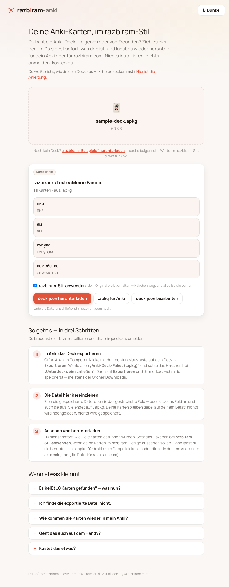
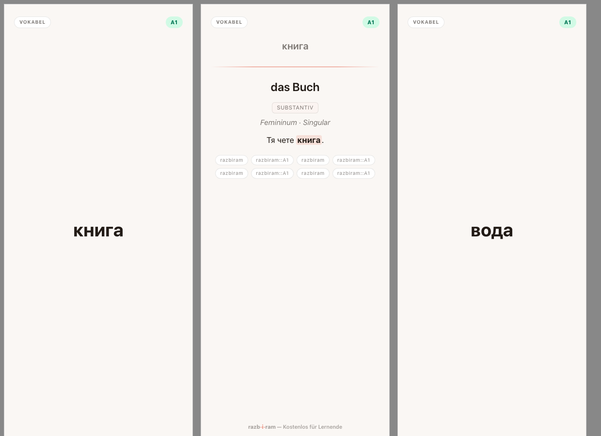
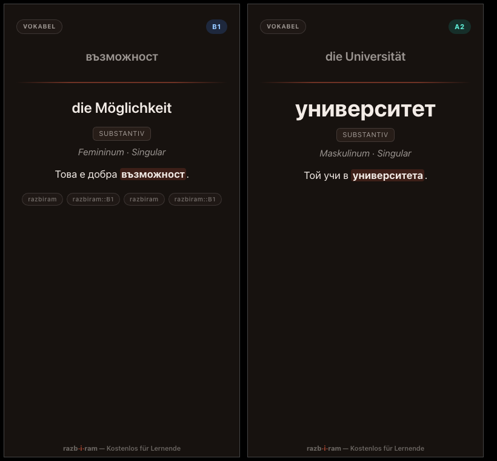
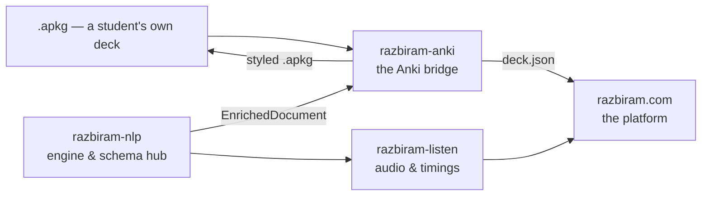

# razbiram-anki

Bring deine Anki-Karten in den razbiram-Stil — im Browser, ohne Anmeldung, kostenlos.

*Turns a student's own Anki deck into razbiram-styled cards, and into the
`deck.json` razbiram.com reads — entirely in the browser.*



---

## 👋 Du lernst mit Anki?

Dann brauchst du von dieser Seite fast nichts — nur das hier:

**→ [Die Anleitung in einfachen Schritten](ANLEITUNG.md)**

Sie erklärt, wie du dein Deck aus Anki herausbekommst, was du hier damit machst
und was zu tun ist, wenn etwas klemmt. Die gleiche Anleitung steht auch direkt in
der App — du musst dir also nichts merken und nichts mitnehmen.

Kurz gesagt:

1. In Anki das Deck exportieren (rechte Maustaste → **Exportieren** → *Anki-Deck-Paket (.apkg)*).
2. Die Datei hier hereinziehen.
3. Herunterladen — als **.apkg** für dein Anki oder als **deck.json** für razbiram.com.

**Deine Karten verlassen deinen Computer nicht.** Kein Konto, keine
Nachverfolgung, keine Kosten.

So sehen die Karten danach aus, hell und dunkel:




---

## Part of the razbiram ecosystem



- **[razbiram-nlp](https://github.com/leonkoellerwirth-arch/razbiram-nlp)** — the
  engine and the home of the `EnrichedDocument` schema.
- **razbiram-anki** (this repo) — the bridge across the Anki boundary, both ways.
- **razbiram-listen** — audio in, timings out.
- **razbiram.com** — the platform students actually learn on.

The forward direction (`EnrichedDocument` → styled `.apkg`) is frozen in
`legacy/`. The reverse direction — a student's own `.apkg` → CrowdAnki
`deck.json`, plus a razbiram-styled `.apkg` for their own Anki — is this app and
the current focus.

---

## Quickstart (for developers)

```bash
./start.sh          # install dependencies if needed, then start the dev server
npm run build       # tsc --noEmit && vite build
npm test            # unit tests, including the round-trip golden-set
```

`./scripts/gate.sh` runs the full quality gate; `./scripts/state.sh` prints the
factual state of the repo.

---

## What it does

| | |
|---|---|
| **Reads** | `.apkg` (schema 11 through 18, including zstd-compressed `.anki21b`) and existing CrowdAnki `deck.json` files |
| **Writes** | CrowdAnki `deck.json` (plus a `media/` folder) and a real `.apkg` |
| **Styles** | the razbiram card theme — warm palette, coral accent, the Studio CEFR scale, full dark mode — applied to note models on request |
| **Preserves** | the student's original note models. The style toggle is reversible, and note GUIDs are kept, so a re-import updates instead of duplicating |
| **Sends** | nothing. No network calls, no telemetry, no accounts — the conversion runs in the browser |

The style replaces the CSS of every note model, but rewrites **templates** only
for models with exactly two fields. Anything richer keeps its own layout, because
a rewrite would silently drop fields off the card.

---

## Methodology — evaluated, not assumed

The house heuristic here is the **deck round-trip**, kept as a regression test
rather than a claim:

- `.apkg → deck.json → .apkg → re-parse`, asserted field for field: note count,
  field values, tags, deck hierarchy, note models, media bytes and GUIDs
  (`src/apkg/write.test.ts`).
- `.apkg → deck.json` resolved exactly the way razbiram.com's own
  `ankiNoteParser` walks it (`src/crowdanki/deckJson.test.ts`).
- The `.apkg` writer is verified **against Anki's own importer**, not only against
  our parser — and its SQLite schema was dumped from a real collection rather than
  written from memory.
- The example deck's Bulgarian is checked entry by entry; anything uncertain is
  dropped rather than guessed (BIBLE §8).

`scripts/smoke-decks.sh` runs the real pipeline over a folder of real Anki
exports, because one fixture is not a sample.

---

## Roadmap (planned, not promised)

- A live card preview in the app, so the style is visible before downloading.
- The guide hosted on razbiram.com.
- razbiram-styled templates for cloze, multiple-choice and image-occlusion models.
- Migration of the schema namespace `studywithme-bg.*` → `razbiram.*`.

---

## Disclaimer & licence

*Anki* is a trademark of its respective owners. razbiram is not affiliated with,
endorsed by, or connected to the Anki project.

The code is **MIT** licensed — see [LICENSE](LICENSE). The **visual identity**
(the warm palette, the coral accent, the CEFR scale, the type choices and the
`razb·i·ram` wordmark) is **© razbiram.com** and is *not* covered by the MIT
licence. It travels inside every styled deck: attribute it, do not relicense it.

---

Built by [Leon Köllerwirth Hlihel](https://leon-koellerwirth.com) — AI governance &
agentic engineering in regulated environments ·
[LinkedIn](https://www.linkedin.com/in/leon-koellerwirth/)
