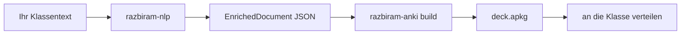

# Für Lehrkräfte: Vom Klassentext zum Anki-Deck in 5 Minuten

Diese Anleitung richtet sich an Lehrkräfte (Zielgruppe razbiram.schule), die aus einem eigenen Text ein fertiges Vokabel-Deck für die Klasse erzeugen wollen. Vorkenntnisse in Anki genügen; Programmierkenntnisse sind nicht nötig.

## Der Ablauf in drei Schritten



1. **Text anreichern.** Lassen Sie Ihren Text durch [razbiram-nlp](https://github.com/leonkoellerwirth-arch/razbiram-nlp) laufen. Ergebnis ist eine `enriched.json` mit Lemmata, Wortarten, Glossen und CEFR-Bändern.
2. **Deck bauen.** Ein Befehl verwandelt das JSON in ein Anki-Deck:

   ```bash
   razbiram-anki build --in enriched.json --out kurs-deck.apkg \
     --title "Lektion 3 – Am Markt" --gloss de --levels A1,A2
   ```

3. **Verteilen.** Geben Sie die `.apkg`-Datei an die Klasse (E-Mail, Lernplattform, USB). Import in Anki: *Datei → Importieren…*.

## Noch einfacher für Schüler:innen: direkt in Anki (kein Import)

Wenn Anki mit dem kostenlosen Add-on **AnkiConnect** geöffnet ist, landen die Karten mit `sync` direkt im Anki der/des Lernenden — der Import-Schritt entfällt komplett:

```bash
razbiram-anki sync --in enriched.json --title "Lektion 3 – Am Markt" --gloss de
```

```
✓ Verbunden mit Anki (127.0.0.1:8765)
✓ 24 Vokabeln in Deck „razbiram::Texte::Lektion 3 – Am Markt" (24 neu, 0 aktualisiert)
→ Direkt lernbereit — kein Import nötig.
```

**AnkiConnect einrichten (einmalig):** Anki öffnen → *Extras → Add-ons → Add-ons herunterladen* → Code **`2055492159`** → Anki neu starten. Läuft Anki nicht, sagt Ihnen das Tool genau, was zu tun ist, und Sie können jederzeit auf `build` (`.apkg`) ausweichen.

Ein erneutes `sync` desselben Textes **aktualisiert** die Karten der Schüler:innen, statt Dubletten anzulegen — ideal, wenn Sie einen Text nachträglich korrigieren.

## Nützliche Stellschrauben

| Ziel | Flag | Beispiel |
| --- | --- | --- |
| Nur bestimmte Niveaus | `--levels` | `--levels A1,A2` — nur Anfängerwörter |
| Anfängerklasse (keine Aktiv-Karten) | `--no-produce` | erzeugt nur *Erkennen*-Karten |
| Deck nicht zu groß | `--max-cards` | `--max-cards 25` — behält die **schwersten** 25 Wörter |
| Nur deutsche Glossen | `--gloss` | `--gloss de` |
| Seltene Fachwörter weglassen | `--min-freq-rank` | `--min-freq-rank 8000` |
| Unterdeck-Struktur | `--deck-name` | `--deck-name "razbiram::Klasse 7b::{title}"` |

Statt vieler Flags können Sie die Einstellungen einmalig in eine YAML-Datei schreiben und mit `--config kurs.yml` laden — einzelne Flags überschreiben die Datei bei Bedarf.

## Warum sich der Aufwand lohnt

- **Re-Import aktualisiert statt zu duplizieren.** Korrigieren Sie den Text und bauen Sie neu — die Karten der Schüler:innen werden aktualisiert, es entstehen keine Dubletten. (Voraussetzung: gleicher `--title`, denn er ist Teil der Karten-Identität.)
- **Beispielsätze aus Ihrem Text.** Jede Karte zeigt das Wort im Satz aus dem Originaltext, das Zielwort hervorgehoben — kein Wort ohne Kontext.
- **CEFR-Badges.** Schüler:innen sehen auf einen Blick, wie schwer ein Wort ist.

## Häufige Fragen

**Muss die Klasse Anki kaufen?** Nein. Anki Desktop und AnkiDroid (Android) sind kostenlos; nur AnkiMobile (iOS) ist kostenpflichtig. Das Deck funktioniert überall.

**Kann ich mehrere Texte in einem Oberdeck bündeln?** Ja, über `--deck-name` mit `::`, z. B. `"razbiram::Klasse 7b::{title}"`. Jeder Text wird ein Unterdeck.

**Was, wenn ein Wort keine Übersetzung hat?** Wörter ohne verwendbare Glosse werden übersprungen (eine Karte ohne Bedeutung ist nutzlos) und in der Zusammenfassung gezählt.
